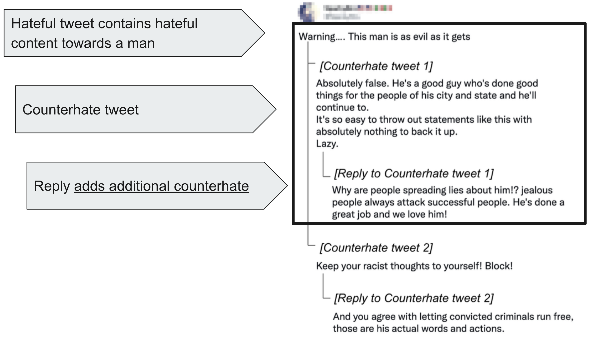

# Mitigating the Risks of Counterhate Replies on Social Media

This repository contains the corpus and code of the *SEM-2023 paper "Not All Counterhate Tweets Elicit the Same Replies: A Fine-Grained Analysis." Authors: Abdullah Albanyan, Ahmed Hassan, and Eduardo Blanco.
<br />
[[paper link](https://aclanthology.org/2023.starsem-1.8/)]

## Introduction
This study aims to identify the kind of replies counterhate tweets elicit. Specifically, we investigate replies to counterhate tweets beyond whether the reply agrees or disagrees with the counterhate tweet by answering the following questions:

* Q1: Does the reply _agree_ with the counterhate tweet?
* If Q1 is _No_ (the reply disagrees with the counterhate tweet):
   * Q2: _Supports_ the hateful tweet?
   * Q3: _Attacks the author_ of the counterhate tweet?
* If Q1 is _Yes_ (the reply agrees with the counterhate tweet):
   * Q4: Adds _additional counterhate_?


## Example

The following Twitter thread originated with a hateful tweet. In the first example, The reply to the first counterhate tweet not only agrees with the counterhate tweet but also includes additional counterhate (i.e., he’s done a great job):

<p align="center">

</p>

Conversely, the reply to the second counterhate tweet not only disagrees with the counterhate tweet but also includes an opinion supporting the hateful tweet (i.e., letting convicted criminals run free):
<p align="center">

</p>

## Citation

```
@inproceedings{albanyan-etal-2023-counterhate,
    title = "Not All Counterhate Tweets Elicit the Same Replies: A Fine-Grained Analysis",
    author = "Albanyan, Abdullah  and
      Hassan, Ahmed  and
      Blanco, Eduardo",
    booktitle = "Proceedings of the The 12th Joint Conference on Lexical and Computational Semantics (*SEM 2023)",
    month = jul,
    year = "2023",
    address = "Toronto, Canada",
    publisher = "Association for Computational Linguistics",
    url = "https://aclanthology.org/2023.starsem-1.8",
    pages = "71--88",
    abstract = "Counterhate arguments can effectively fight and limit the spread of hate speech. However, they can also exacerbate the hate, as some people may respond with aggression if they feel threatened or targeted by the counterhate. In this paper, we investigate replies to counterhate arguments beyond whether the reply agrees or disagrees with the counterhate argument. We present a corpus with 2,621 replies to counterhate arguments countering hateful tweets, and annotate them with fine-grained characteristics. We show that (a) half of the replies (51{\%}) to the counterhate arguments disagree with the argument, and (b) this kind of reply often supports the hateful tweet (40{\%}). We also analyze the language of counterhate arguments that elicit certain types of replies. Experimental results show that it is feasible to anticipate the kind of replies a counterhate argument will elicit.",
}

```
